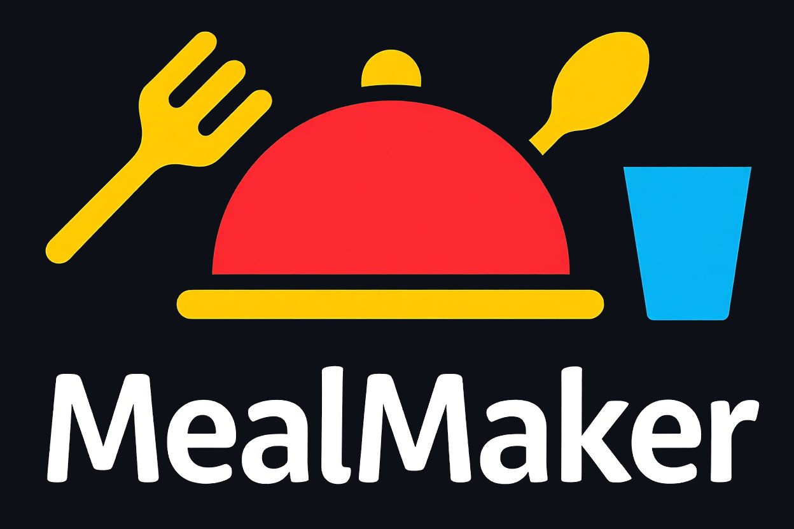

<div align="center">
  
</div>

MealMaker is a mobile-focused web application designed as the main ordering page for a restaurant. Customers must select exactly one main dish, one drink and one dessert before submitting their order. After that, a WhatsApp message is automatically generated, allowing users to send their order with a single tap.

---

**🌍 LIVE DEMO**

🔗 [GitHub Pages](https://glfarias.github.io/MealMaker)

---

**🚀 HOW TO RUN LOCALLY**
1. Clone the repository:

```bash
git clone https://github.com/your-username/MealMaker.git
```

2. Navigate into the project folder:
```bash
cd MealMaker
```

3. Open **index.html** in your browser by double-clicking the file or use Live Server in VS Code for better development experience.

---

**🛠️ BUILT WITH**
- HTML5
- CSS3
- Vanilla JavaScript ES6+

---

**✨ FEATURES**
- Choose one item per category (main dish, drink, dessert)
- Visual confirmation of selected products
- Prevents multiple selections per category (replaces previous choice)
- Order button is only enabled after full selection
- Order button animation after full selection
- Visual confirmation of all selected products before submitting the order
- Auto-generates a WhatsApp message with the selected items and prices

---

**💡 WHAT I LEARNED**

Working on this project significantly improved my front-end development skills. Throughout the project, I developed and strengthened the following abilities:
- Built functional web features using Vanilla JavaScript, without relying on frameworks
- Gained confidence using DOM properties, methods and traversal techniques to navigate and manipulate elements
- Applied proper use of event listeners, dynamically handling user interactions
- Applied proper use of iteration methods such as 'for' and 'forEach'
- Wrote reusable code by refactoring repeated logic into a single dynamic function
- Understood and applied conditional rendering and class toggling for real-time UI feedback
- Git and GitHub workflows, including resolving merge conflicts and writing meaningful commits
- Simulated real-world order submission by integrating with WhatsAppWeb through URL-based actions
- Improved CSS structuring and styling skills
- Wrote clear documentation and improved project communication through a structured README